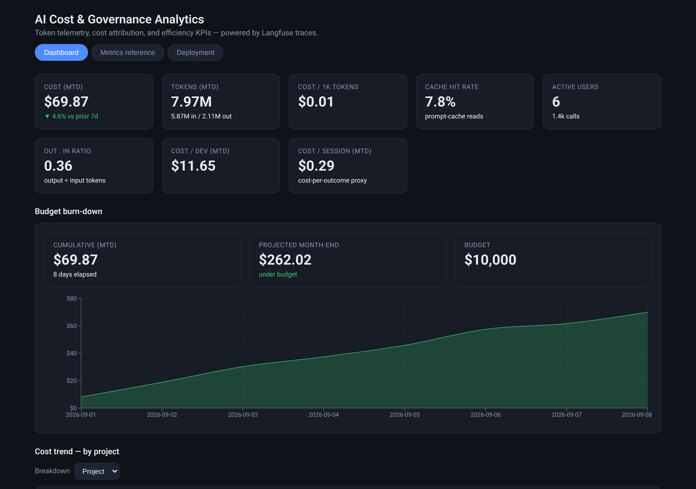
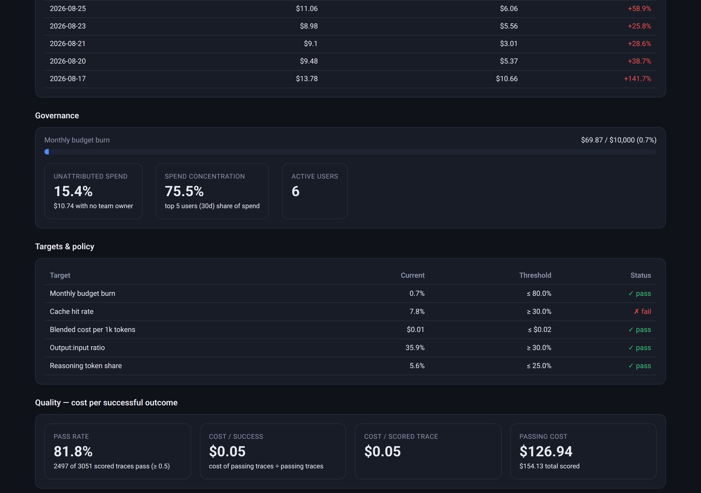
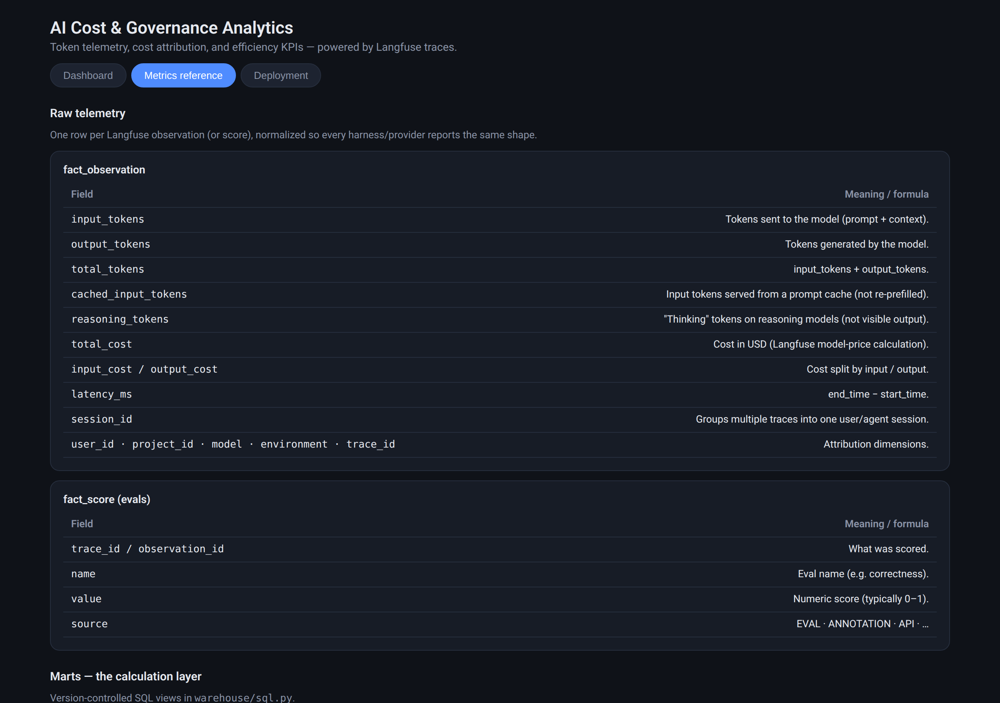
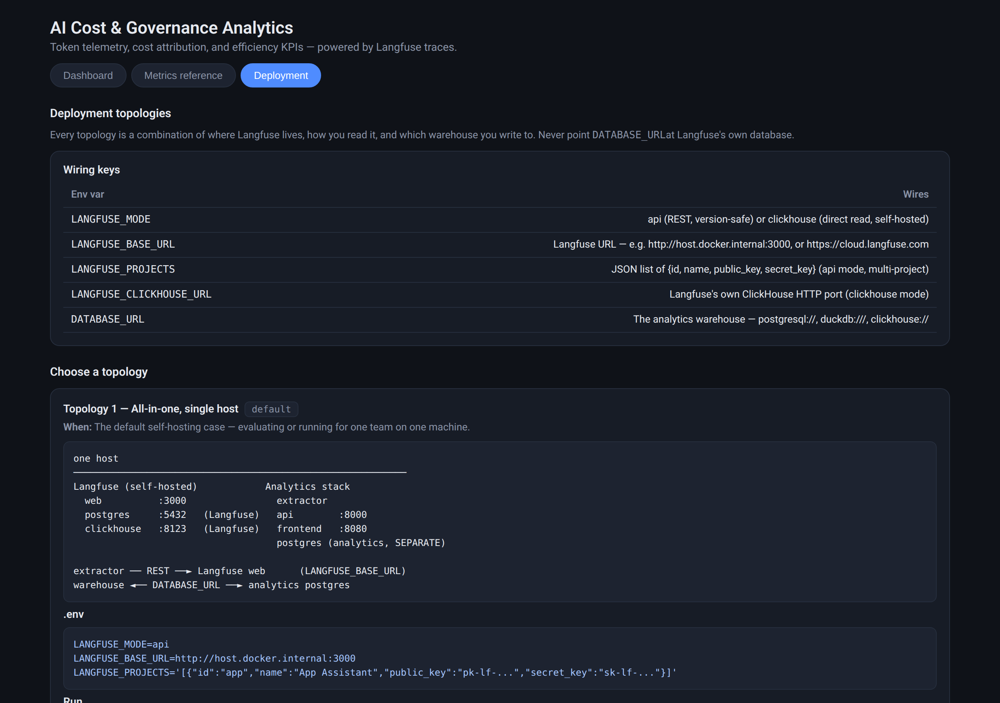
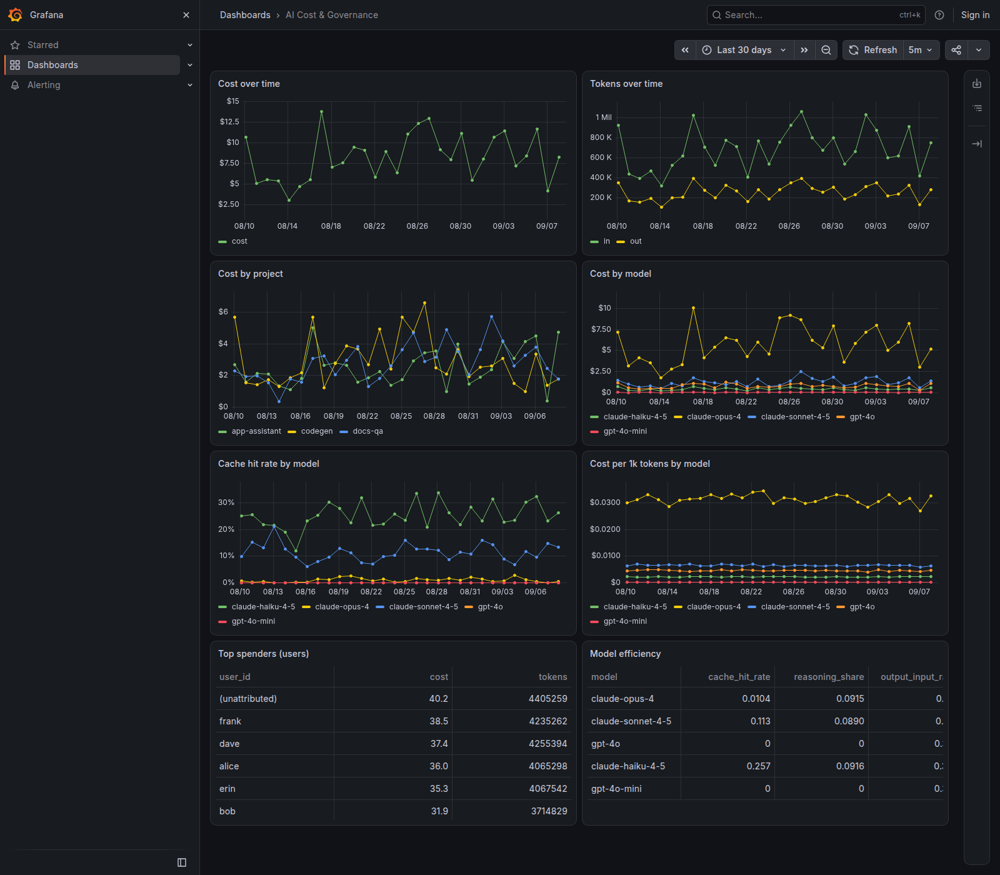

# AI Cost & Governance Analytics for Langfuse

A containerized analytics stack that sits **behind** Langfuse and turns its
trace telemetry into organization-level AI cost & governance KPIs — the
"deeper dive than Langfuse itself."

Langfuse is the *collection* layer (it already normalizes token usage and cost
across Claude Code, Anthropic, OpenAI, etc.). This repo is the *calculation and
serving* layer: a pluggable warehouse, version-controlled SQL marts, a FastAPI
semantic layer, and a React dashboard.

> **Deployment note.** This is a self-hosted stack intended to run on your own
> machine or inside your own network. The API ships with **no authentication**
> and Compose binds every port to loopback by default. If you set
> `BIND_HOST=0.0.0.0` or expose it any other way, put authentication in front
> of it first: every KPI route, including per-user spend attributed to teams and
> departments, is readable by anyone who can reach the port. Tracked in
> [issue #6](https://github.com/ClemenceChee/langfuse-cost-governance/issues/6).

## Highlights

- **Multi-project roll-up** — one dashboard across every Langfuse project.
- **Pluggable warehouse** — Postgres (default), ClickHouse (scale), or embedded
  DuckDB (local/CI); swap with one `DATABASE_URL`. See [docs/warehouse.md](docs/warehouse.md).
- **Calculation layer in SQL** — cache-hit rate, reasoning-token share,
  cost-per-1k-tokens, unattributed-spend %, budget burn.
- **Governance attribution** — map `userId` → team/department so cost rolls up
  to real cost centres, and untagged spend becomes visible.
- **Behaviour governance** — surface `canon`'s ratified policies, TTRP,
  precision@14 and decision divergence alongside cost, via a `canon export →
  ingest` seam ([docs/canon-integration.md](docs/canon-integration.md)).
- **Grafana-ready** — the SQL marts are queryable from Grafana (provisioning +
  a sample dashboard included); see [docs/grafana.md](docs/grafana.md).

## Screenshots

**Dashboard** — cost, tokens, efficiency, and governance KPIs at a glance:



**Targets & policy** — pass/fail against governance thresholds:



**Metrics reference** — every metric, its formula, and why it matters, built into the app:



**Deployment** — five wiring topologies with diagrams and commands:



**Grafana** — the same marts served from Grafana (12-panel dashboard, auto-provisioned):



## Architecture

```
Claude Code / Anthropic / OpenAI / other harnesses
                 │  traces (OTel / SDK / API)
                 ▼
        ┌─────────────────────┐
        │  Langfuse (self-hosted)   ← unchanged tracing source
        └─────────┬───────────┘
                  │ ① extract (api mode: one key per project · clickhouse mode: direct)
                  ▼
   ┌───────────────────────────────────────────┐
   │ ① extractor  →  ② warehouse  →  ③ SQL marts │  DATA FACTORY
   │  (Postgres · ClickHouse · DuckDB)           │  CALCULATION LAYER
   └────────────────────┬───────────────────────┘
                        │ ④ serve (FastAPI)
                        ▼
   ┌───────────────────────────────────────────┐
   │  React dashboard + nginx (/api proxy)     │  SOFTWARE FACTORY
   └───────────────────────────────────────────┘
```

| Service | Role | Key files |
|---|---|---|
| `extractor` | Pulls observations+scores for every project, normalizes, upserts | `extractor/` |
| `warehouse` | Pluggable warehouse + SQL calculation layer | `warehouse/` |
| `api` | FastAPI semantic layer serving the KPIs | `api/kpis.py` |
| `frontend` | React (Vite + Recharts) dashboard | `frontend/` |

## Quickstart

**Pick ONE warehouse.** Options A/B/C below are the same stack with a different
warehouse behind it — they are mutually exclusive alternatives. Run a single
`docker compose` command; running more than one spins up redundant warehouses
whose ports collide.

> **If you self-host Langfuse:** Langfuse already runs its own Postgres,
> ClickHouse, Redis, and MinIO containers. Those belong to Langfuse, not this
> repo. This repo adds **one more** database — the analytics warehouse you pick
> below — on its own port, and never touches Langfuse's databases.

### Option A — Docker + Postgres (default)

```bash
cp .env.example .env
docker compose up -d --build
make seed          # load ~30 days of demo data
# open http://localhost:8080   (warehouse Postgres exposed on :5433, not :5432)
```

### Option B — DuckDB (zero database server)

```bash
cp .env.example .env
docker compose -f docker-compose.duckdb.yml up -d --build
docker compose -f docker-compose.duckdb.yml run --rm api python seed_demo.py
# open http://localhost:8080
```

### Option C — ClickHouse (scale tier)

Bundled ClickHouse server, for large volumes / long lookback:

```bash
cp .env.example .env
docker compose -f docker-compose.clickhouse.yml up -d --build
docker compose -f docker-compose.clickhouse.yml run --rm api python seed_demo.py
# open http://localhost:8080
```

Or point `DATABASE_URL` at an existing ClickHouse. Warehouse tiers and the
trade-offs are documented in [docs/warehouse.md](docs/warehouse.md).

## Deployment guide

The app runs the same everywhere — only the wiring changes. Pick one:

| Topology | Run | When |
|---|---|---|
| **1. Single host** (Postgres, default) | `docker compose up -d --build` | self-hosted Langfuse, one machine |
| **2. Zero-server** (DuckDB) | `docker compose -f docker-compose.duckdb.yml up -d --build` | laptop / CI / eval |
| **3. Scale tier** (ClickHouse) | `docker compose -f docker-compose.clickhouse.yml up -d --build` | large volume / long lookback |
| **4. Langfuse Cloud + managed warehouse** | set `DATABASE_URL` to Neon/Supabase/RDS/CH-Cloud | no self-hosted DB |
| **5. Reuse Langfuse's ClickHouse** | `LANGFUSE_MODE=clickhouse` + a separate `DATABASE_URL` DB | zero extra infra (advanced) |
| **6. Grafana instead of the React UI** | `docker compose -f docker-compose.grafana.yml up` | you already run Grafana |

The Grafana wiring is tested end-to-end: `docker compose -f docker-compose.grafana.yml up -d` provisions the Postgres warehouse, a `warehouse` datasource (health check returns `Database Connection OK`), and the *AI Cost & Governance* dashboard (12 panels) at <http://localhost:3001> (admin / admin). Query recipes per panel are in [docs/grafana.md](docs/grafana.md).

Optional **DeepSeek Harness (DSH)** ingestion: `docker compose -f docker-compose.grafana.yml --profile dsh up -d` adds a sidecar that upserts new DSH sessions into the warehouse every `DSH_INGEST_INTERVAL_SECONDS` (default 300s), reading `~/.dsh/sessions` (override with `DSH_SESSIONS_DIR`). Ingested spend is attributed to `DSH_USER_ID` (default `local`), since DSH logs carry no user identity of their own.

**Behaviour governance (canon)** ingestion ships in both compose files as a `canon-ingest` sidecar: it polls the directory canon writes its `canon export --format json` documents into (default `./canon-state`, override with `CANON_EXPORT_DIR`) and upserts them every `CANON_INGEST_INTERVAL_SECONDS` (default 300s). Idempotent and safe to leave running with an empty directory. Full run commands + the JSON contract: [docs/canon-integration.md](docs/canon-integration.md).

Then wire your Langfuse with `LANGFUSE_PROJECTS` ([below](#connect-your-langfuse)).

Full diagrams, exact env vars, and trade-offs: **[docs/topologies.md](docs/topologies.md)**
(also available in-app under the *Deployment* tab, after you've run it).

## Connect your Langfuse

1. For each Langfuse project, create an API key: *Project → Settings → API
   Keys*. Copy the `pk-lf-…` and `sk-lf-…` pair.
2. Put them in `.env` as a JSON list:

   ```ini
   LANGFUSE_MODE=api
   LANGFUSE_BASE_URL=http://host.docker.internal:3000
   LANGFUSE_PROJECTS='[
     {"id":"app-assistant","name":"App Assistant","public_key":"pk-lf-...","secret_key":"sk-lf-..."},
     {"id":"codegen","name":"Code Generation","public_key":"pk-lf-...","secret_key":"sk-lf-..."}
   ]'
   ```

3. `docker compose up -d --build`. The extractor syncs every
   `SYNC_INTERVAL_SECONDS` (default 300s), re-covering the last
   `LOOKBACK_DAYS` with idempotent upserts (safe to restart).

### Two extraction modes

- **`api` (default, version-safe):** pulls the current Langfuse surfaces —
  `/api/public/v2/observations` and `/api/public/v3/scores` — per project with
  cursor pagination. No deprecated `/traces` endpoint (v2 observations already
  carry the trace context: userId, sessionId, environment, tags).
- **`clickhouse` (fast, self-hosted only):** reads Langfuse's own ClickHouse
  directly. `project_id` comes from the rows, so this mode rolls up all
  projects natively. Column names vary by Langfuse release — adjust
  `extractor/clickhouse_client.py` to match your version.

## Configuration

| Variable | Default | Purpose |
|---|---|---|
| `LANGFUSE_MODE` | `api` | `api` or `clickhouse` source |
| `LANGFUSE_BASE_URL` | `http://host.docker.internal:3000` | Langfuse web URL |
| `LANGFUSE_PROJECTS` | — | JSON list of `{id, name, public_key, secret_key}` |
| `LANGFUSE_PUBLIC_KEY` / `_SECRET_KEY` | — | single-project shorthand |
| `DATABASE_URL` | `postgresql://…` | warehouse URL (`postgresql`/`duckdb`/`clickhouse`) |
| `LOOKBACK_DAYS` | `30` | re-sync window (idempotent) |
| `SYNC_INTERVAL_SECONDS` | `300` | sync cadence |
| `BATCH_SIZE` | `1000` | observations per API page |

## The calculation layer

The KPIs are SQL, version-controlled in `warehouse/sql.py` (written once
against a `Dialect`):

- `mrt_daily_usage` — project × team × user × model × day grain; tokens
  (input/output/cached/reasoning) and cost.
- `mrt_model_efficiency` — cache-hit rate, reasoning share, out/in ratio,
  cost-per-1k-tokens, avg latency.
- `mrt_session` — session grain; context per session, turns per session, cost
  per session (the context-creep and cost-per-outcome signals).
- `mrt_org_daily` — whole-org daily roll-up.
- `mrt_governance_daily` — behaviour governance: the latest canon snapshot per
  day (proposals/ratifications over time).
- `mrt_policy_coverage` — share of traces covered by ratified policy evidence.

Governance attribution (`dim_user` team/department, `budget`) is seeded by the
demo loader and maintained by editing the warehouse; the extractor lazily
registers unseen `userId`s as `team='Unassigned'`, which is what surfaces
"unattributed spend" on the dashboard.

**Every metric, its exact formula, and why it matters is documented in the
app itself (the "Metrics reference" tab) and in [docs/metrics.md](docs/metrics.md).**
The in-app catalog lives in `frontend/src/metrics.js` — the single source of
truth; `docs/metrics.md` is generated from it (`make docs`).

## KPI API

| Endpoint | KPIs |
|---|---|
| `/api/kpis/overview` | MTD cost, tokens, cost/1k, cache-hit rate, out:in ratio, cost/dev, cost/session, active users, WoW cost Δ |
| `/api/kpis/daily?dimension=&days=` | Daily cost/tokens by project·team·user·model |
| `/api/kpis/top?dimension=&metric=&days=&limit=` | Top spenders |
| `/api/kpis/efficiency` | Per-model efficiency |
| `/api/kpis/governance` | Budget burn, unattributed spend %, spend concentration, active users |
| `/api/kpis/behaviour` | Behaviour governance (canon): metrics (TTRP, precision@14, proposals), ratified policies, divergence by model × task |
| `/api/kpis/targets` | Governance targets with pass/fail status (cache hit, out:in, reasoning share, cost/1k, burn) |
| `/api/kpis/sessions?days=&limit=` | Context/turns per session, cost per session, input per turn |
| `/api/kpis/anomalies?days=&threshold=` | Cost spikes vs. rolling baseline / z-score / day-of-week |
| `/api/kpis/quality?threshold=` | Pass rate, cost per successful outcome (from Langfuse evals) |
| `/api/kpis/burndown` | Cumulative cost vs budget + month-end forecast |
| `/api/kpis/model-daily?days=&model=` | Efficiency (cache-hit, cost/1k, out:in) as a time series |
| `/api/kpis/hourly?days=&project=` | Intra-day cost/tokens by hour |
| `/api/kpis/baseline?days=` | Rolling baseline, z-score, day-of-week baseline |
| `/api/kpis/periods?days=` | Weekly/monthly rollups with WoW/MoM |
| `/api/kpis/trend?days=` | Rolling slope + change-point detection |
| `/api/kpis/cohort?days=` | Spend by adoption cohort × week |

See [docs/metrics.md](docs/metrics.md) for definitions and calculations.

## Repo layout

```
warehouse/          Pluggable warehouse + SQL calculation layer (dialects/backends)
extractor/          Langfuse client (api + clickhouse), normalize, sync loop
api/                FastAPI semantic layer + demo seeder
frontend/           React dashboard (Vite + Recharts) + nginx
scripts/smoke.py    End-to-end smoke test (used by CI)
docker-compose.yml, docker-compose.duckdb.yml, Makefile, .env.example
```

## Roadmap

1. **Transforms:** promote the SQL marts to **dbt** models (versioned, tested,
   incremental) for a single source of truth at enterprise scale.
2. **Extraction at scale:** Langfuse Cloud's daily S3/GCS Blob export or the
   batch-export API instead of paging the REST API.
3. **Attribution:** load `dim_user` team/department from your IdP/HR system.
4. **Alerts:** budget/anomaly notifications (webhook/email) from the existing
   `/governance` and `/anomalies` signals.
5. **More warehouses:** Snowflake, BigQuery, MySQL — see CONTRIBUTING.md.

## License

[MIT](LICENSE) · Built by [clemence.io](https://clemence.io)
